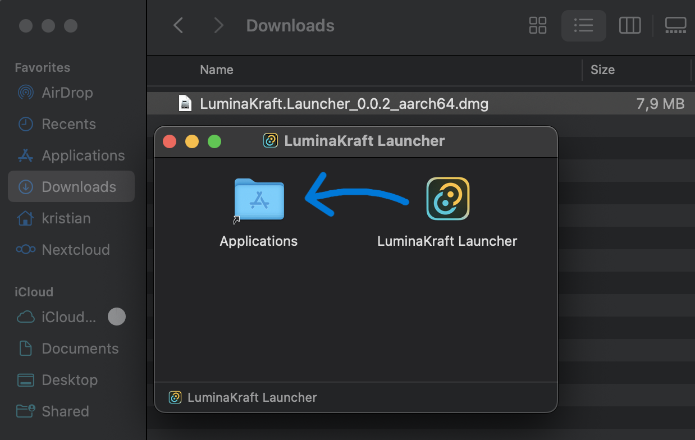
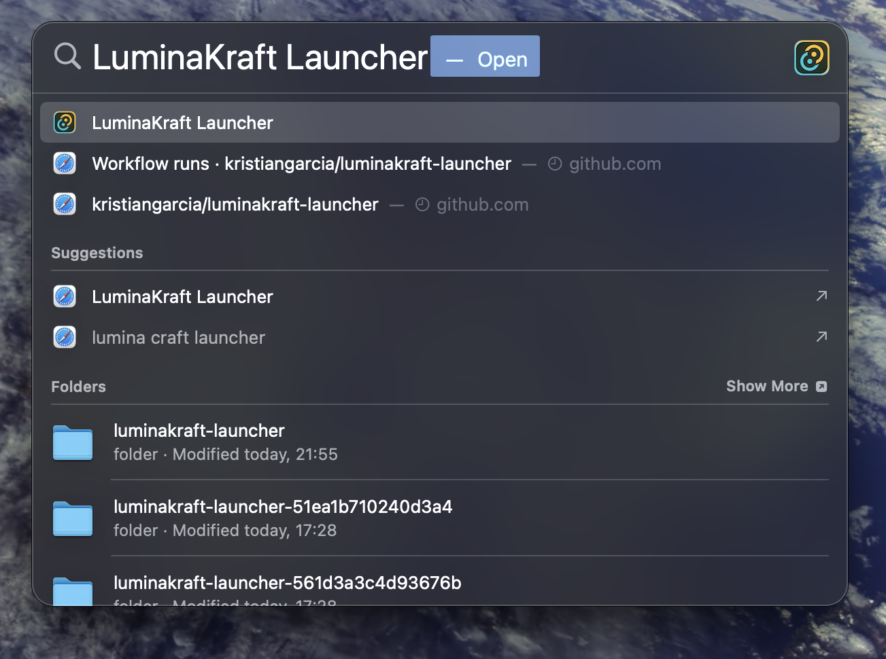
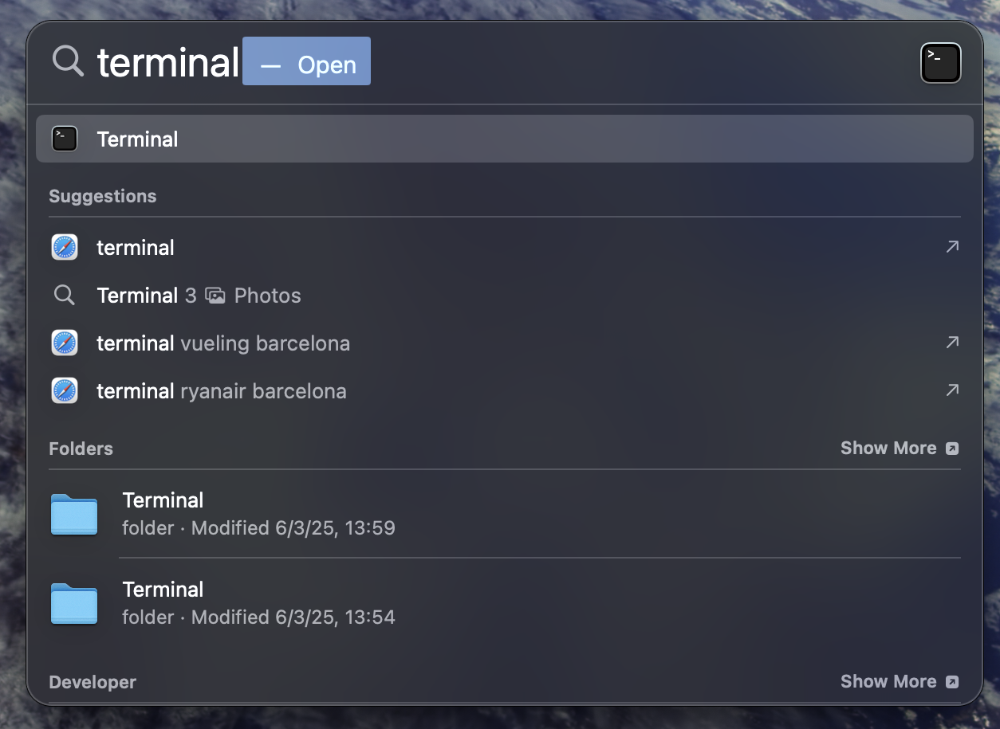
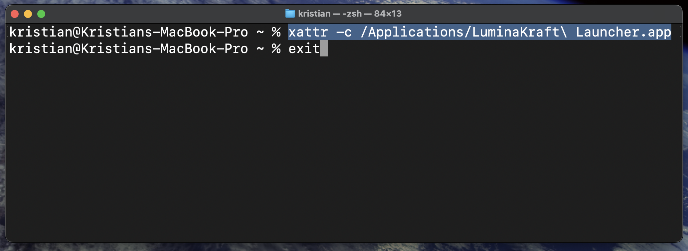

# 🚀 LuminaKraft Launcher - Releases

> **Un lanzador de modpacks personalizado para Minecraft, desarrollado específicamente para la comunidad de LuminaKraft Studios.**

## 📋 Descripción

**LuminaKraft Launcher** es un lanzador moderno y eficiente para modpacks de Minecraft, construido con tecnología de vanguardia (Tauri, React, TypeScript y Rust) y potenciado por la biblioteca Lyceris. Ofrece una experiencia completa de gestión de modpacks con actualizaciones automáticas, soporte offline y una interfaz intuitiva.

### ✨ Características Principales

- 🎮 **Gestión Completa de Modpacks**: Instalación automática y gestión de instancias aisladas
- 🔄 **Actualizaciones Automáticas**: Sistema completamente automático con un solo clic
- ⚡ **Gestión Automática de Java**: Descarga e instala automáticamente la versión correcta de Java
- 🎯 **Modo Offline**: Compatible con usuarios premium y no premium
- 🖥️ **Interfaz Moderna**: Diseño intuitivo con tema oscuro y componentes responsivos
- 🛠️ **Múltiples Modloaders**: Soporte para Forge, Fabric, Quilt y NeoForge
- 📊 **Descargas Optimizadas**: Descargas paralelas 3-5x más rápidas con verificación de integridad

---

## 💾 Descarga e Instalación

### 📥 Descargas Multiplataforma

**👉 [Descargar Última Versión](https://github.com/luminakraft/luminakraft-launcher-releases/releases/latest)**

#### 🪟 Windows
| Tipo | Descripción | Recomendado Para |
|------|-------------|------------------|
| **`.msi`** | MSI Installer - Instalador completo con registro en sistema | ✅ **Usuarios generales** |
| **`.exe`** | NSIS Installer - Instalador alternativo | 💻 Usuarios avanzados |

#### 🐧 Linux
| Tipo | Descripción | Recomendado Para |
|------|-------------|------------------|
| **`.AppImage`** | Aplicación portable | ✅ **Recomendado - Funciona en todas las distribuciones** |
| **`.deb`** | Paquete DEB | 🟢 Debian/Ubuntu |
| **`.rpm`** | Paquete RPM | 🔴 Red Hat/Fedora/openSUSE |

#### 🍎 macOS
| Tipo | Descripción | Recomendado Para |
|------|-------------|------------------|
| **`.dmg`** | DMG Image - Instalación drag & drop | ✅ **Recomendado para todos** |
| **🍎 Apple Silicon** | `aarch64-apple-darwin` | ✨ **M1/M2/M3/M4 Macs** |
| **💻 Intel Macs** | `x86_64-apple-darwin` | 🔧 Soporte legacy |

### 🔧 Pasos de Instalación

#### 🪟 Windows

**Para archivo `.msi` (Recomendado):**
1. **Descarga** el archivo `.msi` desde la [página de releases](https://github.com/luminakraft/luminakraft-launcher-releases/releases/latest)
2. **Ejecuta** el archivo descargado como administrador
3. **Sigue** el asistente de instalación
4. **Busca** "LuminaKraft Launcher" en el menú de inicio

**Para archivo `.exe` (NSIS):**
1. **Descarga** el archivo `.exe` desde la [página de releases](https://github.com/luminakraft/luminakraft-launcher-releases/releases/latest)
2. **Ejecuta** el instalador como administrador
3. **Sigue** las instrucciones del asistente
4. **Busca** la aplicación en el menú de inicio

#### 🐧 Linux

**Para AppImage (Recomendado):**
1. **Descarga** el archivo `.AppImage`
2. **Otorga permisos de ejecución**: `chmod +x LuminaKraft-Launcher-*.AppImage`
3. **Ejecuta** directamente: `./LuminaKraft-Launcher-*.AppImage`

**Para DEB (Debian/Ubuntu):**
1. **Descarga** el archivo `.deb`
2. **Instala** con: `sudo dpkg -i LuminaKraft-Launcher-*.deb`
3. **Resuelve dependencias** si es necesario: `sudo apt-get install -f`

**Para RPM (Red Hat/Fedora):**
1. **Descarga** el archivo `.rpm`
2. **Instala** con: `sudo rpm -i LuminaKraft-Launcher-*.rpm`
3. **O usa dnf**: `sudo dnf install LuminaKraft-Launcher-*.rpm`

#### 🍎 macOS

**Para DMG (Recomendado):**
1. **Descarga** el archivo `.dmg` apropiado para tu Mac
   - 🍎 **Apple Silicon** (M1/M2/M3/M4): Descarga la versión `aarch64-apple-darwin`
   - 💻 **Intel Mac**: Descarga la versión `x86_64-apple-darwin`
2. **Abre** el archivo `.dmg`
3. **Arrastra** LuminaKraft Launcher a la carpeta Applications
4. **Ejecuta** desde Launchpad o Applications

---

## ⚙️ Requisitos del Sistema

### Requisitos Mínimos:

#### 🪟 Windows
- **Sistema Operativo**: Windows 10 (build 1903) o superior
- **RAM**: 4 GB (mínimo), 8 GB recomendado
- **Espacio en Disco**: 2 GB libres (más espacio para modpacks)
- **Conexión a Internet**: Requerida para descargas y actualizaciones

#### 🐧 Linux
- **Distribuciones**: Ubuntu 18.04+, Debian 10+, Fedora 32+, openSUSE Leap 15.2+
- **Arquitectura**: x86_64 (64-bit)
- **RAM**: 4 GB (mínimo), 8 GB recomendado
- **Espacio en Disco**: 2 GB libres (más espacio para modpacks)
- **Conexión a Internet**: Requerida para descargas y actualizaciones

#### 🍎 macOS
- **Sistema Operativo**: macOS 10.15 (Catalina) o superior
- **Arquitectura**: 
  - 🍎 Apple Silicon (M1/M2/M3/M4) - Soporte nativo
  - 💻 Intel x86_64 - Soporte completo
- **RAM**: 4 GB (mínimo), 8 GB recomendado
- **Espacio en Disco**: 2 GB libres (más espacio para modpacks)
- **Conexión a Internet**: Requerida para descargas y actualizaciones

### Requisitos Automáticos:
- ☑️ **Java**: Se instala automáticamente (no requiere instalación manual)
- ☑️ **Actualizaciones**: Sistema automático integrado
- ☑️ **Dependencias**: Todas las librerías necesarias están incluidas

---

## 🔄 Sistema de Actualizaciones Automáticas

### ✨ Características de las Actualizaciones:

- **🔍 Detección Automática**: Verifica nuevas versiones al iniciar la aplicación
- **📱 Notificaciones Elegantes**: Interfaz moderna para gestionar actualizaciones
- **⚡ Un Clic para Actualizar**: Descarga, instala y reinicia automáticamente
- **🔒 Seguridad**: Descargas verificadas directamente desde GitHub
- **📝 Notas de Versión**: Muestra qué hay de nuevo en cada actualización

### 🔄 Proceso de Actualización:
1. El launcher verifica automáticamente al iniciar
2. Te notifica si hay una nueva versión disponible
3. Un clic descarga e instala la actualización
4. El launcher se reinicia automáticamente con la nueva versión

---

## 📸 Capturas de Pantalla

### 🍎 Capturas de macOS

> **Nota**: Las siguientes capturas de pantalla fueron tomadas en macOS, mostrando la experiencia nativa en sistemas Apple.

#### 📥 Proceso de Descarga

*Descarga del LuminaKraft Launcher desde la página de releases de GitHub*

#### 🔍 Búsqueda en el Sistema

*Localización del launcher instalado en macOS usando Spotlight*

#### 💻 Solución de Problemas - Terminal

*Acceso a la Terminal de macOS para resolver problemas de permisos*

#### ⚡ Comandos de Terminal

*Ejecución del comando `xattr -c` para resolver el problema "La aplicación está dañada"*

### ✨ Vista Previa de Características:
- 🎮 Pantalla principal con lista de modpacks disponibles
- ⚙️ Panel de configuración avanzada (RAM, Java, rutas)
- 📊 Monitor de descargas en tiempo real con progreso
- 🔄 Sistema de actualizaciones automáticas integrado
- 🌙 Interfaz moderna con tema oscuro
- 🎯 Soporte completo para modo offline

### 🔜 Próximas Capturas:
- 🪟 Proceso de instalación en Windows (.msi/.exe)
- 🐧 Instalación en Linux (AppImage/DEB/RPM)
- 🎮 Interfaz principal del launcher en funcionamiento
- ⚙️ Panel de configuración detallado
- 📊 Sistema de actualizaciones en acción
- 🗂️ Gestión de múltiples instancias de modpacks

---

## ❓ Preguntas Frecuentes (FAQ)

### 🔧 Instalación y Configuración

**Q: ¿Necesito instalar Java por separado?**  
A: No, LuminaKraft Launcher utiliza la biblioteca Lyceris que descarga e instala automáticamente la versión correcta de Java para cada modpack.

**Q: ¿Funciona sin cuenta premium de Minecraft?**  
A: Sí, el launcher tiene soporte completo para modo offline y usuarios sin cuenta premium.

**Q: ¿Dónde se instalan los modpacks?**  
A: En `%APPDATA%\LuminaKraftLauncher\instances\` - cada modpack en su propia carpeta aislada.

### 🚫 Problemas Comunes

#### 🪟 Windows

**Q: "La aplicación no se abre" o "Error al iniciar"**  
A: 
1. Ejecuta como administrador
2. Verifica que Windows Defender no esté bloqueando el archivo
3. Descarga nuevamente desde el enlace oficial

#### 🐧 Linux

**Q: "Permission denied" al ejecutar AppImage**  
A: 
1. Otorga permisos de ejecución: `chmod +x LuminaKraft-Launcher-*.AppImage`
2. Si persiste, ejecuta como: `sudo ./LuminaKraft-Launcher-*.AppImage`

**Q: "Error de dependencias" en DEB/RPM**  
A: 
1. **Ubuntu/Debian**: `sudo apt-get install -f`
2. **Fedora**: `sudo dnf install --skip-broken`
3. **openSUSE**: `sudo zypper install --no-recommends`

#### 🍎 macOS

**Q: "La aplicación está dañada y no se puede abrir"**  
A: 
1. **Causa**: macOS marca las aplicaciones descargadas con atributo de cuarentena
2. **Solución**:
   - Abre la Terminal
   - Ejecuta: `xattr -c /Applications/LuminaKraftLauncher.app`
   - (Reemplaza la ruta con la ubicación de tu aplicación)
   - Intenta abrir la aplicación nuevamente

**Q: "Apple no pudo verificar que 'LuminaKraft Launcher' está libre de malware"**  
A: 
1. Abre **Configuración del Sistema**
2. Ve a **Privacidad y Seguridad**
3. Desplázate hasta la parte inferior
4. Verás el mensaje "LuminaKraft Launcher fue bloqueado"
5. Haz clic en **"Abrir de todos modos"**

**Q: "Problemas de permisos en macOS"**  
A: 
1. Da permisos de ejecución: `chmod +x /Applications/LuminaKraftLauncher.app/Contents/MacOS/LuminaKraftLauncher`
2. Si persiste, ejecuta desde Terminal: `open /Applications/LuminaKraftLauncher.app`

#### 🌐 Problemas Generales

**Q: "Error de descarga de modpack"**  
A: 
1. Verifica tu conexión a internet
2. El sistema reintentará automáticamente las descargas fallidas
3. Lyceris incluye verificación de integridad automática

**Q: "Problemas de memoria/RAM"**  
A: 
1. Ajusta la RAM asignada en Configuración
2. El launcher optimiza automáticamente la configuración JVM
3. Recomendamos mínimo 4GB de RAM total en el sistema

### 🔄 Actualizaciones

**Q: ¿Cómo actualizo el launcher?**  
A: Las actualizaciones son completamente automáticas. El launcher te notificará cuando haya una nueva versión y se actualizará con un clic.

**Q: ¿Perderé mis modpacks al actualizar?**  
A: No, todas tus instancias, configuraciones y partidas guardadas se mantienen intactas durante las actualizaciones.

---

## 🔗 Enlaces Oficiales

### 🌐 Sitios Web y Comunidad
- **🏠 [Sitio Web Oficial](https://luminakraft.com)** - Página principal de LuminaKraft Studios
- **💬 [Discord Oficial](https://discord.gg/luminakraft)** - Comunidad, soporte y noticias
- **📺 [YouTube](https://youtube.com/@luminakraft)** - Tutoriales y contenido oficial
- **🐦 [Twitter](https://twitter.com/luminakraft)** - Actualizaciones y anuncios

### 🛠️ Soporte Técnico
- **🐛 [Reportar Problemas](https://github.com/luminakraft/luminakraft-launcher-releases/issues)** - Issues de GitHub
- **📖 [Documentación](https://docs.luminakraft.com)** - Guías detalladas
- **❓ [Centro de Ayuda](https://help.luminakraft.com)** - Base de conocimientos

---

## ⚠️ Información Importante

### 🔒 Código Fuente
> **Nota**: Este repositorio contiene únicamente las **releases públicas** del LuminaKraft Launcher. El código fuente es **privado** y está desarrollado por LuminaKraft Studios. Las releases aquí publicadas son completamente **gratuitas** y **seguras** para uso público.

### 🛡️ Seguridad
- ✅ Todas las releases están firmadas digitalmente
- ✅ Verificación automática de integridad de archivos
- ✅ Sin telemetría invasiva ni recolección de datos personales
- ✅ Código malware-free verificado por Windows Defender

### 📋 Licencia
Este software se distribuye bajo la **Licencia MIT**. Ver [LICENSE](LICENSE) para más detalles.

---

## 🎯 Próximas Características

### 🔮 En Desarrollo:
- ✅ **Soporte Multiplataforma**: **¡YA DISPONIBLE!** - Windows, Linux y macOS
- 🎨 **Temas Personalizables**: Más opciones de personalización de interfaz
- 📊 **Estadísticas Avanzadas**: Métricas de tiempo de juego y rendimiento
- 🔧 **Configuración Cloud**: Sincronización de configuraciones entre dispositivos
- 🏗️ **Gestión de Profiles**: Múltiples perfiles de usuario
- 🔐 **Autenticación Mejorada**: Soporte para cuentas Microsoft
- 📱 **Interfaz Responsive**: Mejor adaptación a diferentes resoluciones
- 🌐 **Localización**: Soporte para más idiomas

---

## 👥 Comunidad y Contribuciones

### 🤝 Únete a Nuestra Comunidad
- **Discord**: Más de 1,000 miembros activos
- **Eventos**: Torneos y eventos regulares de la comunidad
- **Soporte**: Ayuda de la comunidad y staff oficial 24/7

### 📝 Reportar Problemas
Si encuentras algún problema:
1. **Busca** en [issues existentes](https://github.com/luminakraft/luminakraft-launcher-releases/issues)
2. **Crea** un nuevo issue con detalles específicos
3. **Incluye** tu versión de Windows y detalles del error

---

## 📊 Estadísticas del Proyecto

---

## 💖 Desarrollado con ❤️ por LuminaKraft Studios

**¿Te gusta el proyecto? ¡Dale una ⭐ y compártelo con tus amigos!**

[⚡ Descargar Ahora](https://github.com/luminakraft/luminakraft-launcher-releases/releases/latest) • [💬 Discord](https://discord.gg/luminakraft) • [🌐 Sitio Web](https://luminakraft.com)

---

*Última actualización del README: Enero 2024* 