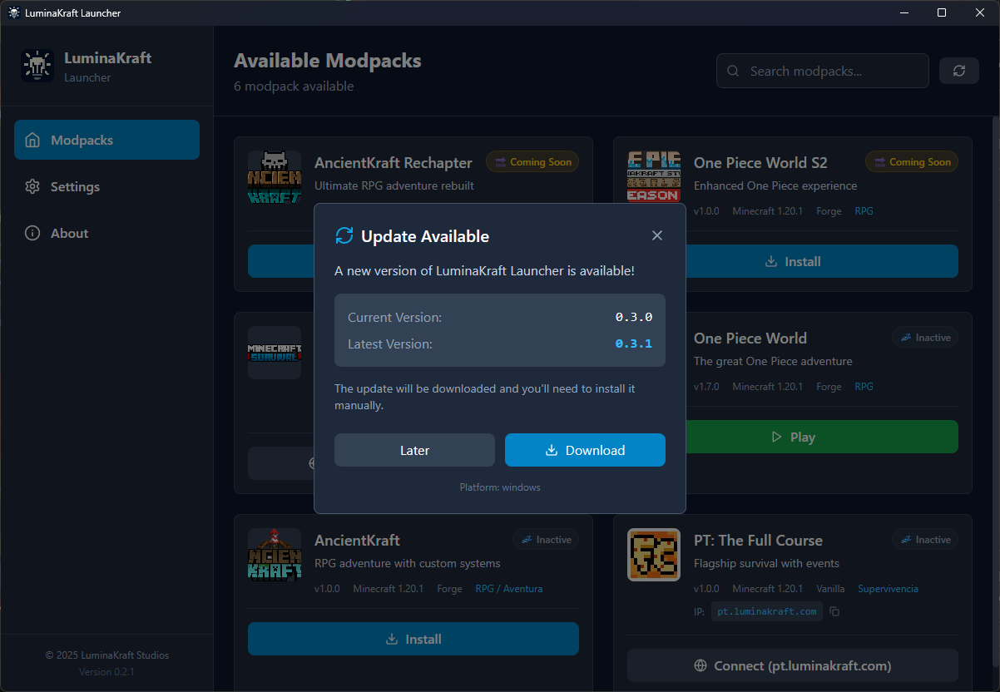

# 🚀 LuminaKraft Launcher - Releases

> **Un lanzador de modpacks personalizado para Minecraft, desarrollado específicamente para la comunidad de LuminaKraft Studios.**

## 📋 Descripción

**LuminaKraft Launcher** es un lanzador moderno para modpacks de Minecraft con actualizaciones automáticas, gestión de Java y soporte multiplataforma.

### ✨ Características

- 🎮 **Gestión de Modpacks**: Instalación automática e instancias aisladas
- 🔄 **Actualizaciones Automáticas**: Un clic para actualizar todo
- ⚡ **Java Automático**: Descarga la versión correcta automáticamente  
- 🎯 **Modo Offline**: Compatible con usuarios premium y no premium
- 🖥️ **Interfaz Moderna**: Tema oscuro y diseño intuitivo
- 🛠️ **Múltiples Modloaders**: Forge, Fabric, Quilt y NeoForge
- 📊 **Descargas Rápidas**: 3-5x más rápido con verificación de integridad

---

## 💾 Descarga e Instalación

## 💾 Descarga

**👉 [Descargar Última Versión](https://github.com/kristiangarcia/luminakraft-launcher-releases/releases/latest)**

| Sistema | Archivo | Descripción |
|---------|---------|-------------|
| 🪟 **Windows** | `.msi` ✅ | Instalador recomendado |
| | `.exe` | Instalador alternativo |
| 🐧 **Linux** | `.AppImage` ✅ | Funciona en todas las distribuciones |
| | `.deb` / `.rpm` | Para Debian/Ubuntu y Red Hat/Fedora |
| 🍎 **macOS** | `.dmg` ✅ | Instalación drag & drop |
| | Apple Silicon / Intel | Ambas arquitecturas soportadas |

### 🔧 Pasos de Instalación

#### 🪟 Windows

**Para archivo `.msi` (Recomendado):**
1. **Descarga** el archivo `.msi` desde la [página de releases](https://github.com/kristiangarcia/luminakraft-launcher-releases/releases/latest)
2. **Ejecuta** el archivo descargado como administrador
3. **Sigue** el asistente de instalación
4. **Busca** "LuminaKraft Launcher" en el menú de inicio

**Para archivo `.exe` (NSIS):**
1. **Descarga** el archivo `.exe` desde la [página de releases](https://github.com/kristiangarcia/luminakraft-launcher-releases/releases/latest)
2. **Ejecuta** el instalador como administrador
3. **Sigue** las instrucciones del asistente
4. **Busca** la aplicación en el menú de inicio

#### 🐧 Linux

**Para AppImage (Recomendado):**
1. **Descarga** el archivo `.AppImage`
2. **Otorga permisos de ejecución**: `chmod +x LuminaKraft-Launcher-*.AppImage`
3. **Ejecuta** directamente: `./LuminaKraft-Launcher-*.AppImage`

**Para DEB (Debian/Ubuntu):**
1. **Descarga** el archivo `.deb`
2. **Instala** con: `sudo dpkg -i LuminaKraft-Launcher-*.deb`
3. **Resuelve dependencias** si es necesario: `sudo apt-get install -f`

**Para RPM (Red Hat/Fedora):**
1. **Descarga** el archivo `.rpm`
2. **Instala** con: `sudo rpm -i LuminaKraft-Launcher-*.rpm`
3. **O usa dnf**: `sudo dnf install LuminaKraft-Launcher-*.rpm`

#### 🍎 macOS

**Para DMG (Recomendado):**
1. **Descarga** el archivo `.dmg` apropiado para tu Mac
   - 🍎 **Apple Silicon** (M1/M2/M3/M4): Descarga la versión `aarch64-apple-darwin`
   - 💻 **Intel Mac**: Descarga la versión `x86_64-apple-darwin`
2. **Abre** el archivo `.dmg`
3. **Arrastra** LuminaKraft Launcher a la carpeta Applications
4. **Ejecuta** desde Launchpad o Applications

---

## ⚙️ Requisitos

| Sistema | Versión | RAM | Notas |
|---------|---------|-----|-------|
| 🪟 Windows | 10+ | 4-8 GB | Automático |
| 🐧 Linux | Ubuntu 18.04+ | 4-8 GB | AppImage recomendado |
| 🍎 macOS | 10.15+ | 4-8 GB | Apple Silicon + Intel |

**✅ Automático**: Java, actualizaciones y dependencias se instalan automáticamente

---

## 🔄 Sistema de Actualizaciones Automáticas

### ✨ Características de las Actualizaciones:

- **🔍 Detección Automática**: Verifica nuevas versiones al iniciar la aplicación
- **📱 Notificaciones Elegantes**: Interfaz moderna para gestionar actualizaciones
- **⚡ Un Clic para Actualizar**: Descarga, instala y reinicia automáticamente
- **🔒 Seguridad**: Descargas verificadas directamente desde GitHub
- **📝 Notas de Versión**: Muestra qué hay de nuevo en cada actualización

### 🔄 Proceso de Actualización:
1. El launcher verifica automáticamente al iniciar
2. Te notifica si hay una nueva versión disponible
3. Un clic descarga e instala la actualización
4. El launcher se reinicia automáticamente con la nueva versión

---

## 📸 Capturas de Pantalla

### 🍎 Capturas de macOS

> **Capturas del proceso de instalación y solución de problemas en macOS**

#### 📥 Proceso de Descarga

*Descarga del LuminaKraft Launcher desde la página de releases de GitHub*

#### 🔍 Búsqueda en el Sistema

*Localización del launcher instalado en macOS usando Spotlight*

#### 💻 Solución de Problemas - Terminal

*Acceso a la Terminal de macOS para resolver problemas de permisos*

#### ⚡ Comandos de Terminal

*Ejecución del comando `xattr -c` para resolver el problema "La aplicación está dañada"*

### ✨ Vista Previa de Características:
- 🎮 Pantalla principal con lista de modpacks disponibles
- ⚙️ Panel de configuración avanzada (RAM, Java, rutas)
- 📊 Monitor de descargas en tiempo real con progreso
- 🔄 Sistema de actualizaciones automáticas integrado
- 🌙 Interfaz moderna con tema oscuro
- 🎯 Soporte completo para modo offline

### 🔜 Próximas Capturas:
- 🪟 Proceso de instalación en Windows (.msi/.exe)
- 🐧 Instalación en Linux (AppImage/DEB/RPM)
- 🎮 Interfaz principal del launcher en funcionamiento
- ⚙️ Panel de configuración detallado
- 📊 Sistema de actualizaciones en acción
- 🗂️ Gestión de múltiples instancias de modpacks

---

## ❓ Preguntas Frecuentes (FAQ)

### 🔧 Instalación y Configuración

**Q: ¿Necesito instalar Java por separado?**  
A: No, LuminaKraft Launcher utiliza la biblioteca Lyceris que descarga e instala automáticamente la versión correcta de Java para cada modpack.

**Q: ¿Funciona sin cuenta premium de Minecraft?**  
A: Sí, el launcher tiene soporte completo para modo offline y usuarios sin cuenta premium.

**Q: ¿Dónde se instalan los modpacks?**  
A: En `%APPDATA%\LuminaKraftLauncher\instances\` - cada modpack en su propia carpeta aislada.

### 🚫 Problemas Comunes

#### 🪟 Windows

**Q: "La aplicación no se abre" o "Error al iniciar"**  
A: 
1. Ejecuta como administrador
2. Verifica que Windows Defender no esté bloqueando el archivo
3. Descarga nuevamente desde el enlace oficial

#### 🐧 Linux

**Q: "Permission denied" al ejecutar AppImage**  
A: 
1. Otorga permisos de ejecución: `chmod +x LuminaKraft-Launcher-*.AppImage`
2. Si persiste, ejecuta como: `sudo ./LuminaKraft-Launcher-*.AppImage`

**Q: "Error de dependencias" en DEB/RPM**  
A: 
1. **Ubuntu/Debian**: `sudo apt-get install -f`
2. **Fedora**: `sudo dnf install --skip-broken`
3. **openSUSE**: `sudo zypper install --no-recommends`

#### 🍎 macOS

**Q: "La aplicación está dañada y no se puede abrir"**  
A: 
1. **Causa**: macOS marca las aplicaciones descargadas con atributo de cuarentena
2. **Solución**:
   - Abre la Terminal
   - Ejecuta: `xattr -c /Applications/LuminaKraftLauncher.app`
   - (Reemplaza la ruta con la ubicación de tu aplicación)
   - Intenta abrir la aplicación nuevamente

**Q: "Apple no pudo verificar que 'LuminaKraft Launcher' está libre de malware"**  
A: 
1. Abre **Configuración del Sistema**
2. Ve a **Privacidad y Seguridad**
3. Desplázate hasta la parte inferior
4. Verás el mensaje "LuminaKraft Launcher fue bloqueado"
5. Haz clic en **"Abrir de todos modos"**

**Q: "Problemas de permisos en macOS"**  
A: 
1. Da permisos de ejecución: `chmod +x /Applications/LuminaKraftLauncher.app/Contents/MacOS/LuminaKraftLauncher`
2. Si persiste, ejecuta desde Terminal: `open /Applications/LuminaKraftLauncher.app`

#### 🌐 Problemas Generales

**Q: "Error de descarga de modpack"**  
A: 
1. Verifica tu conexión a internet
2. El sistema reintentará automáticamente las descargas fallidas
3. Lyceris incluye verificación de integridad automática

**Q: "Problemas de memoria/RAM"**  
A: 
1. Ajusta la RAM asignada en Configuración
2. El launcher optimiza automáticamente la configuración JVM
3. Recomendamos mínimo 4GB de RAM total en el sistema

### 🔄 Actualizaciones

**Q: ¿Cómo actualizo el launcher?**  
A: Las actualizaciones son completamente automáticas. El launcher te notificará cuando haya una nueva versión y se actualizará con un clic.

**Q: ¿Perderé mis modpacks al actualizar?**  
A: No, todas tus instancias, configuraciones y partidas guardadas se mantienen intactas durante las actualizaciones.

---

## 🔗 Enlaces Oficiales

### 🌐 Sitios Web y Comunidad
- **🏠 [Sitio Web Oficial](https://luminakraft.com)** - Página principal de LuminaKraft Studios
- **💬 [Discord Oficial](https://discord.gg/UJZRrcUFMj)** - Comunidad, soporte y noticias
- **📺 [YouTube](https://youtube.com/@luminakraft)** - Tutoriales y contenido oficial
- **🐦 [Twitter](https://twitter.com/luminakraft)** - Actualizaciones y anuncios

### 🛠️ Soporte Técnico
- **🐛 [Reportar Problemas](https://github.com/kristiangarcia/luminakraft-launcher-releases/issues)** - Issues de GitHub

---

## ⚠️ Información Importante

### 🔒 Código Fuente
> **Nota**: Este repositorio contiene únicamente las **releases públicas** del LuminaKraft Launcher. El código fuente es **privado** y está desarrollado por LuminaKraft Studios. Las releases aquí publicadas son completamente **gratuitas** y **seguras** para uso público.

### 🛡️ Seguridad
- ✅ Todas las releases están firmadas digitalmente
- ✅ Verificación automática de integridad de archivos
- ✅ Sin telemetría invasiva ni recolección de datos personales
- ✅ Código malware-free verificado por Windows Defender

### 📜 Licencia
Este software es propiedad de LuminaKraft Studios. Todos los derechos reservados. Está prohibida la copia, modificación o distribución sin autorización expresa.

---

## 🎯 Próximas Características

### 🔮 En Desarrollo:
- ✅ **Soporte Multiplataforma**: **¡YA DISPONIBLE!** - Windows, Linux y macOS
- 🎨 **Temas Personalizables**: Más opciones de personalización de interfaz
- 📊 **Estadísticas Avanzadas**: Métricas de tiempo de juego y rendimiento
- 🔧 **Configuración Cloud**: Sincronización de configuraciones entre dispositivos
- 🏗️ **Gestión de Profiles**: Múltiples perfiles de usuario
- 🔐 **Autenticación Mejorada**: Soporte para cuentas Microsoft
- 📱 **Interfaz Responsive**: Mejor adaptación a diferentes resoluciones
- 🌐 **Localización**: Soporte para más idiomas

---

## 👥 Comunidad y Contribuciones

### 🤝 Únete a Nuestra Comunidad
- **Discord**: Más de 1,000 miembros activos
- **Eventos**: Torneos y eventos regulares de la comunidad
- **Soporte**: Ayuda de la comunidad y staff oficial 24/7

### 📝 Reportar Problemas
Si encuentras algún problema:
1. **Busca** en [issues existentes](https://github.com/kristiangarcia/luminakraft-launcher-releases/issues)
2. **Crea** un nuevo issue con detalles específicos
3. **Incluye** tu versión de Windows y detalles del error

---

## 📊 Estadísticas del Proyecto

---

## 💖 Desarrollado con ❤️ por LuminaKraft Studios

**¿Te gusta el proyecto? ¡Dale una ⭐ y compártelo con tus amigos!**

[⚡ Descargar Ahora](https://github.com/kristiangarcia/luminakraft-launcher-releases/releases/latest) • [💬 Discord](https://discord.gg/UJZRrcUFMj) • [🌐 Sitio Web](https://luminakraft.com)

---

*Última actualización del README: Junio 2025* 
